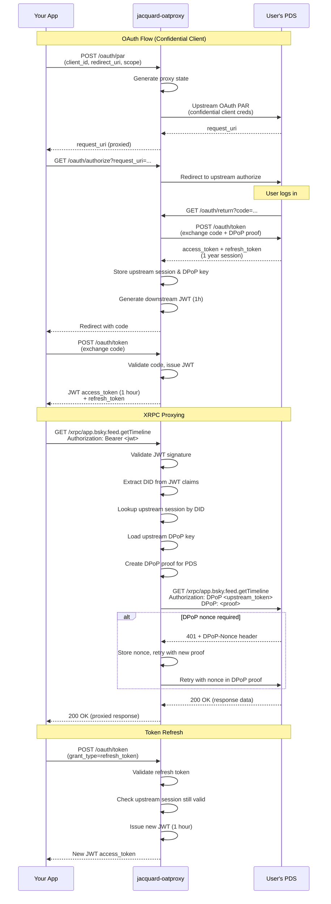

## jacquard-oatproxy

> or: oatproxy but written in rust

jacquard-oatproxy implements a relatively decent OAuth 2.1 authorization server
that sits between ATProto clients and Personal Data Servers (PDSes). 

It allows developers to use standard ATProto SDKs via a more ""secure"" confidential 
client mode and optionally can be used in a BFF (Backend for Frontend) architecture if 
needed. This confidential client mode unlocks longer session times, up from 1 week 
to about a year.

## How this works

The proxy acts as a middleman between your app and the user's PDS. Basically:

1. **Your app starts oauth flow** → proxy intercepts the request
2. **Proxy authenticates with PDS** → uses its own confidential client credentials to get a long-lived session with the user's PDS
3. **Proxy issues tokens to your app** → gives your app short-lived JWT access tokens (1 hour)
4. **Your app makes xrpc requests** → sends requests through the proxy with its JWT
5. **Proxy validates and forwards** → checks the JWT, looks up the upstream session, and forwards the request to the real PDS with proper DPoP authentication

From the PDS's perspective, the proxy is the client. From your app's perspective, the proxy looks like a PDS. This lets you use confidential client mode (longer sessions) while still working with standard ATProto SDKs that expect to talk directly to a PDS.

More completely:


## Usage
You'll need to tell lies to the ATProto SDKs about where your PDS is located :) 
Here are a few ways to do that with some common libraries.

### with atcute
You will need a custom private identity resolver. Here's one.
```ts
/**
 * Wraps an existing identity resolver and rewrites PDS endpoints to point to our OAuth proxy
 */
export class ProxyIdentityResolver implements IdentityResolver {
  constructor(
    private upstream: IdentityResolver,
    private proxyUrl: string,
  ) {}

  async resolve(
    actor: ActorIdentifier,
    options?: ResolveIdentityOptions,
  ): Promise<ResolvedIdentity> {
    // use the upstream resolver to get the actual identity
    const identity = await this.upstream.resolve(actor, options);

    // rewrite the PDS endpoint to point to our proxy
    console.log(
      "Rewriting PDS endpoint from",
      identity.pds,
      "to",
      this.proxyUrl,
    );

    return {
      ...identity,
      pds: this.proxyUrl,
    };
  }
}
```

Use it like so:

```ts
  const proxyResolver = new ProxyIdentityResolver(
    baseResolver,
    OAUTH_PROXY_URL,
  );

  configureOAuth({
    metadata: {
      client_id,
      redirect_uri,
    },
    identityResolver: proxyResolver,
  });
```

### with @atproto/oauth-client-browser (and similar)
You'll need to overwrite the default fetch handler with one that changes the PDS URL to point to the proxy.
```ts
import { BrowserOAuthClient, OAuthClient } from "@atproto/oauth-client-browser";

const fetchWithLies = async (
  oatProxyUrl: string,
  input: RequestInfo | URL,
  init?: RequestInit
) => {
  // Normalize input to a Request object
  let request: Request;
  if (typeof input === "string" || input instanceof URL) {
    request = new Request(input, init);
  } else {
    request = input;
  }

  if (
    request.url.includes("plc.directory") || // did:plc
    request.url.endsWith("did.json") // did:web
  ) {
    const res = await fetch(request, init);
    if (!res.ok) {
      return res;
    }
    const data = await res.json();
    const service = data.service.find((s: any) => s.id === "#atproto_pds");
    if (!service) {
      return res;
    }
    service.serviceEndpoint = oatProxyUrl;
    return new Response(JSON.stringify(data), {
      status: res.status,
      headers: res.headers,
    });
  }

  return fetch(request, init);
};

export default async function createOAuthClient(
  oatProxyUrl: string
): Promise<OAuthClient> {
  return await BrowserOAuthClient.load({
    clientId: `${oatProxyUrl}/oauth/downstream/client-metadata.json`,
    handleResolver: oatProxyUrl,
    responseMode: "query",

    // Lie to the oauth client and use our upstream server instead
    fetch: (input, init) => fetchWithLies(oatProxyUrl, input, init),
  });
}```
